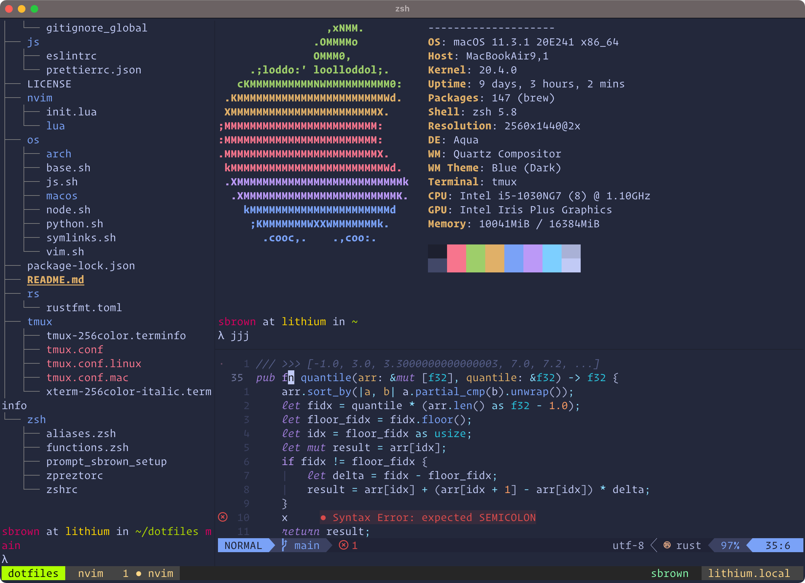

Dotfiles
---------------

This repo is for configuring my terminal environment and other various system settings. It is primarily targeted at macOS and Arch Linux as well as other Unix-like systems. The main toolchain uses is a modernized [Text Triumvirate](https://www.drbunsen.org/the-text-triumvirate/) integrated with contemporary unix tools like exa, bat, fzf, and ripgrep.



## Setup

Dotfiles can be installed with the following commands for Arch Linux or MacOS, respectively.

| OS     | Status | Snippet                                                |
|--------|--------|--------------------------------------------------------|
| Arch Linux |  | `./arch/install.sh` |
| MacOS      |  | `./macos/install.sh` |


## Test with Docker

Build a test Arch Linux container using [Docker](https://www.docker.com) to validate the environment is set up correctly.

```shell
$ ./bin/archlinux-docker-setup.sh
```

## Noteworthy Packages

| Package                                                      | Description                                                      |
|--------------------------------------------------------------|------------------------------------------------------------------|
| [Hyper](https://hyper.is)                                    | Electron-based Terminal                                          |
| [zsh](https://github.com/zsh-users/zsh)                      | Z Shell (extended Bourne Shell)                                  |
| [prezto](https://github.com/sorin-ionescu/prezto)            | Lightweight configuration framework for Zsh                      |
| [neovim](https://github.com/zsh-users/zsh)                   | extensible Vim-based text editor                                 |
| [tmux](https://github.com/tmux/tmux)                         | terminal multiplexer                                             |
| [fzf](https://github.com/junegunn/fzf)                       | Fuzzy-finder for Zsh and Neovim                                  |
| [ripgrep](https://github.com/BurntSushi/ripgrep)             | Faster grep with modern features                                 |
| [bat](https://github.com/sharkdp/bat)                        | modern cat clone                                                 |
| [exa](https://github.com/ogham/exa)                          | modern ls clone                                                  |
| [diff-so-fancy](https://github.com/so-fancy/diff-so-fancy)   | modern diff clone                                                |
| [jq](https://stedolan.github.io/jq/)                         | sed for JSON data                                                |


## Language Support

Language support is minimal to keep the enviroment as light weight as possible and to allow individual customization. Basic Python, Node.js, Javascript, and Typescript are supported with linters via [ALE](https://github.com/dense-analysis/ale).
